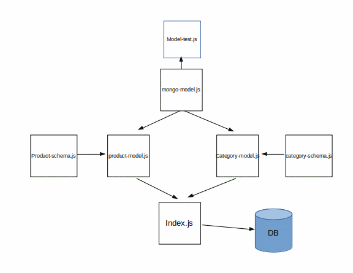

# LAB - 05

## Data Modeling with NoSQL Databases

### Author: Travis Skyles

### Links and Resources
* [submission PR]()
* [travis](https://travis-ci.com/tskyles-401-advanced-javascript/401-lab-05)

#### Documentation
* `jsdocs` found at `/docs` endpoint

### Setup
#### `.env` requirements (where applicable)
* `MONGODB_URI` - URL to the running mongo instance/db

#### How to initialize/run your server app (where applicable)
* `npm start`
* Endpoint: /docs
  * Returns JSdocs
  
#### Tests
* Unit Tests: `npm test`
* Lint Tests: `npm run lint`

#### UML
